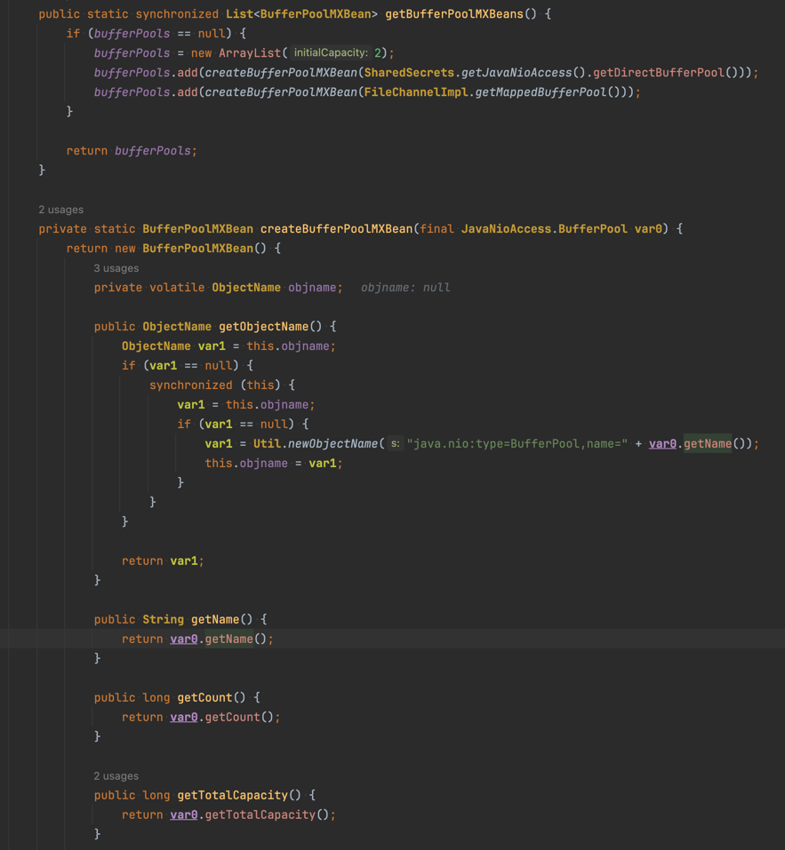

## 一、MXBean监控直接内存案例

MXBean使用`BufferPoolMXBean`监控jvm直接内存使用。

```java
private static final Logger LOG = LoggerFactory.getLogger(MemoryStatics.class);

    public static BufferPoolMXBean directMBean;
    public static BufferPoolMXBean mappedMXBean;

    static {
        List<BufferPoolMXBean> bufferPoolMXBeans = ManagementFactory.getPlatformMXBeans(BufferPoolMXBean.class);

        for (BufferPoolMXBean mbean : bufferPoolMXBeans) {
            if (mbean.getName().equals("direct")) {
                directMBean= mbean;
            } else {
                mappedMXBean = mbean;
            }
        }
    }
    public void monitor() {

        while (true) {
            assert directMBean != null;
            LOG.info("buffer pool name: " + directMBean);
            LOG.info("memory used: " + directMBean.getMemoryUsed());
            LOG.info("max memory : " + directMBean.getTotalCapacity());
            LOG.info("contain buffers : " + directMBean.getCount());
            LOG.info("---------------------------------------");
            try {
                Thread.sleep(1000);
            } catch (InterruptedException e) {
                throw new RuntimeException(e);
            }
        }
```

## 二、原理分析
真正的实现类是JDK的`sun.management.ManagementFactoryHelper`(JDK8) 【可以直接打印mbean对象，可以看见如下输出`sun.management.ManagementFactoryHelper$1@de2b39c`】:



上面这段代码可以看到有getName、getCount、getTotalCapacity等方法，其真正实现都是在`java.nio.Bits`中，实现如下：


Bits类中有几个静态成员，简单说明：
```java
// 最大直接内存，默认和-Xmx配置的大小一样
private static volatile long maxMemory = VM.maxDirectMemory();
// 剩余的直接内存大小
private static final AtomicLong reservedMemory = new AtomicLong();
// 已使用的直接内存大小
private static final AtomicLong totalCapacity = new AtomicLong();
```

在使用`java.nio.ByteBuffer.allocateDirect`或者`DirectByteBuffer`**主构造函数**时，每次分配直接内存都会调用Bits类进行实际分配并更新`reservedMemory`和`totalCapacity`等值。

`DirectByteBuffer`主构造函数如下：


### netty的直接内存分配
netty直接内存分配最终是通过`PlatformDependent`实现的，这个类有个原子类的静态成员`DIRECT_MEMORY_COUNTER`独立进行内存使用记录，不依赖`Bits`.

```java
// PlatformDependent直接内存记录
private static final AtomicLong DIRECT_MEMORY_COUNTER;
```

每次要申请一块新的direct memory的时候, 它就调用`incrementMemoryCounter`方法去增加 `DIRECT_MEMORY_COUNTER` 的值：


最终是通过反射实例化`DirectByteBuffer`，用的是下面的构造函数：


`PlatformDependent0`反射实例化代码：


**因此netty所分配的直接内存大小，常规的监控手段无法监测，包括arthas、visualvm中的MBean、以及其他所有通过jmx获取直接内存数据的手段。**