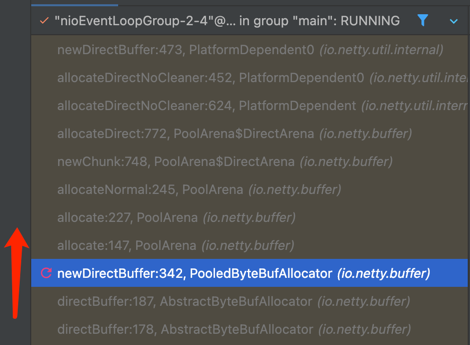
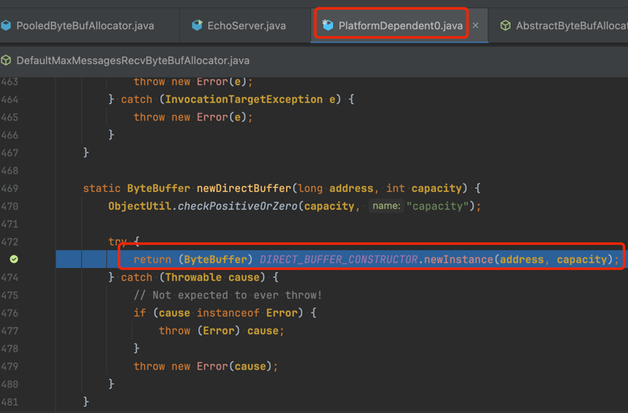
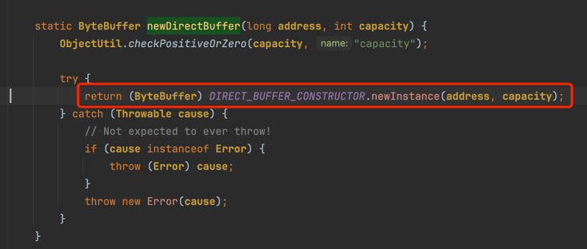
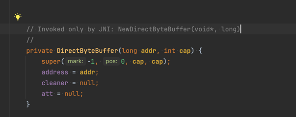
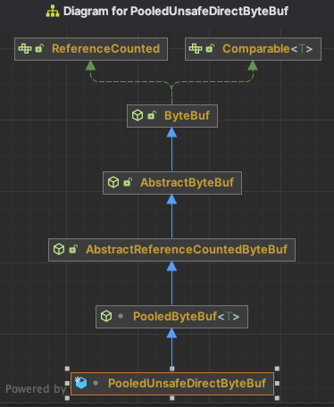
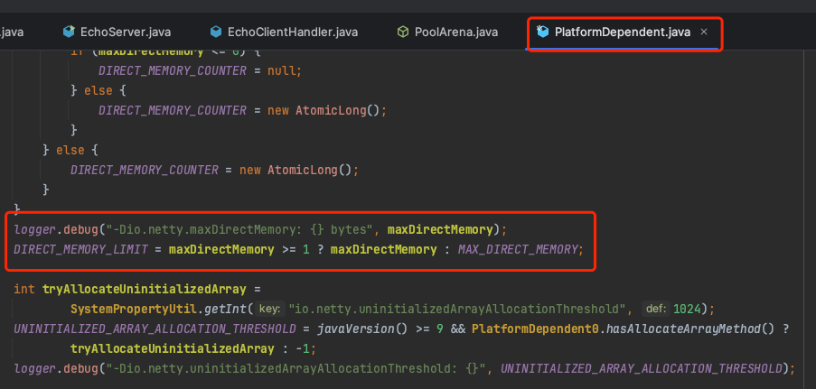
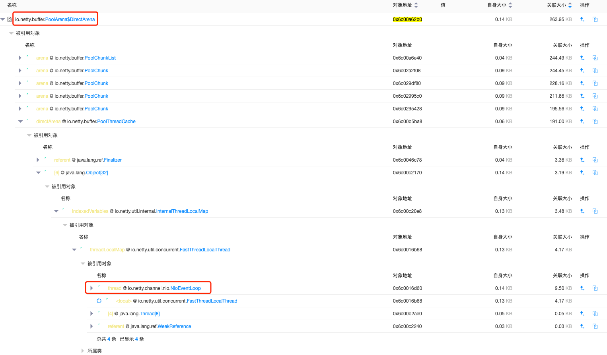

## netty默认direct memory分配流程

最终会调用`io.netty.util.internal.PlatformDependent0`的`newDirectBuffer`方法进行分配

`io.netty.util.internal.PlatformDependent0.newDirectBuffer`通过反射的方式，创建`java.nio.DirectByteBuffer(long,int)`

直接绕过了常规JDK接口分配，因此常规的工具无法监控此类分配方法的direct memory占用。

## 内存泄漏场景

默认堆外直接内存池类对象：`PooledUnsafeDirectByteBuf`

### 1. 版本较低，存在BUG
相关版本号（待梳理）

### 2. 编码问题
Netty在处理网络数据时，在Read网络数据时由Netty创建Buffer，Write网络数据时Buffer往往是由业务方创建的。不管是读和写，Buffer用完后都必须进行释放，否则可能会造成内存泄露。
在Write网络数据时，可以确保数据被写往网络了，Netty会自动进行Buffer的释放，因为Netty会在 pipeline中安装两个Handle:
【相关类DefaultChannelPipeline】
1. `TailContext`
2. `HeadContext`

**Handler的顺序：**
- **网络 -> Head -> 自定义Handler -> Tail** 

Head同时会处理出站和入站，_**在Head中会负责将出站的Buffer释放**_。 但是下面的两种情况就会出现问题：

**_Write网络数据时_**，有outBoundHandler处理(重写/拦截)了write()操作并丢弃了数据， 没有继续往下写，就要由我们负责释放这个Buffer，必须调用ReferenceCountUtil.release方法，否则就可能会造成内存泄露。

_**Read网络数据时**_，如果我们可以确保每个InboundHandler都把数据往后传递了，也就是调用了相关的`fireChannelRead`方法，Netty也会帮我们释放，这个是由Tail负责的。同样，如果有InboundHandler处理了数据，又不继续往后传递，又没有调用负责释放的ReferenceCountUtil.release方法，就可能会造成内存泄露。

由于消费入站数据是一项常规任务，所以Netty提供了一个特殊的被称为 SimpleChannelInboundHandler的ChannelInboundHandler实现。这个实现会在数据 被channelRead0()方法消费之后自动释放数据。

## 关于netty应用最大直接内存

优先使用`-Dio.netty.maxDirectMemory`配置参数设置的值，如果没有设置则使用jvm层面限制的最大直接内存大小；

### netty默认使用的直接内存

#### netty每个work线程-nioEventLoop都会通过PoolThreadLocalCache，绑定一块内存区域PoolArea，避免多线程下内存分配发生冲突，降低性能；

#### release大致流程
PooledUnsafeDirectByteBuf回收流程
io.netty.buffer.AbstractReferenceCountedByteBuf#release()
io.netty.util.internal.ReferenceCountUpdater#release(T)
io.netty.buffer.AbstractReferenceCountedByteBuf#handleRelease
io.netty.buffer.PooledByteBuf#deallocate【如果开启了泄漏检测，在此将WeakReference的referent设置为null】
io.netty.buffer.PooledByteBuf#recycle

待研究：https://kkewwei.github.io/elasticsearch_learning/2018/07/20/Netty-PoolChunk%E5%8E%9F%E7%90%86%E6%8E%A2%E7%A9%B6/