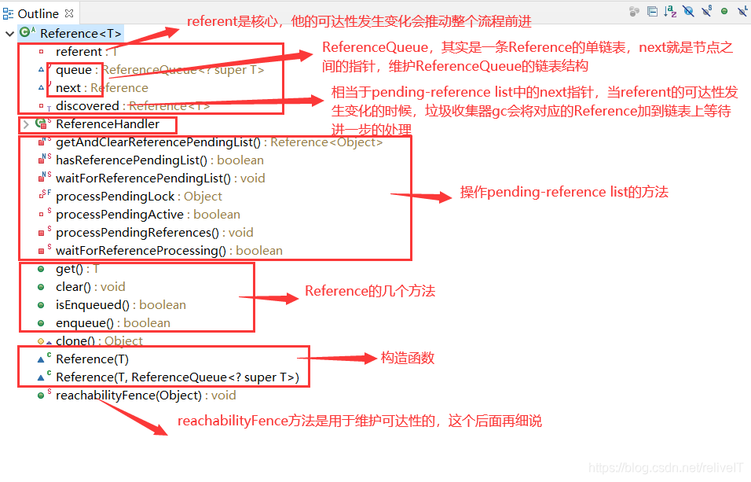
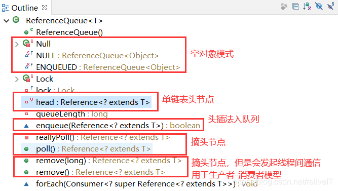
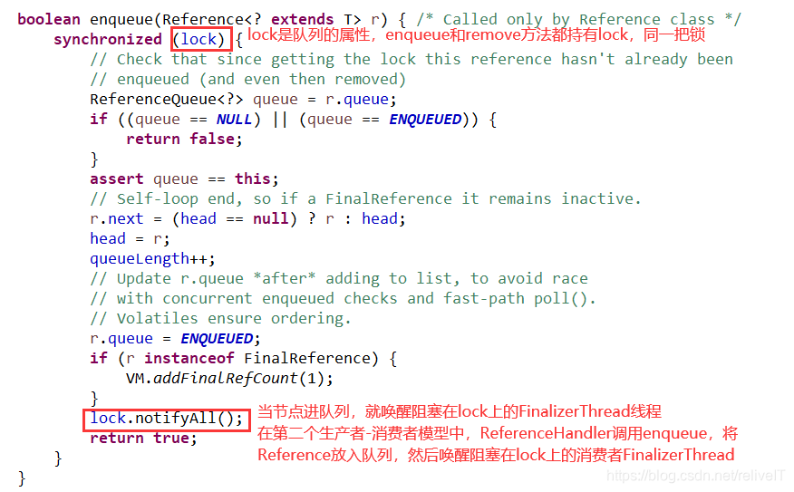
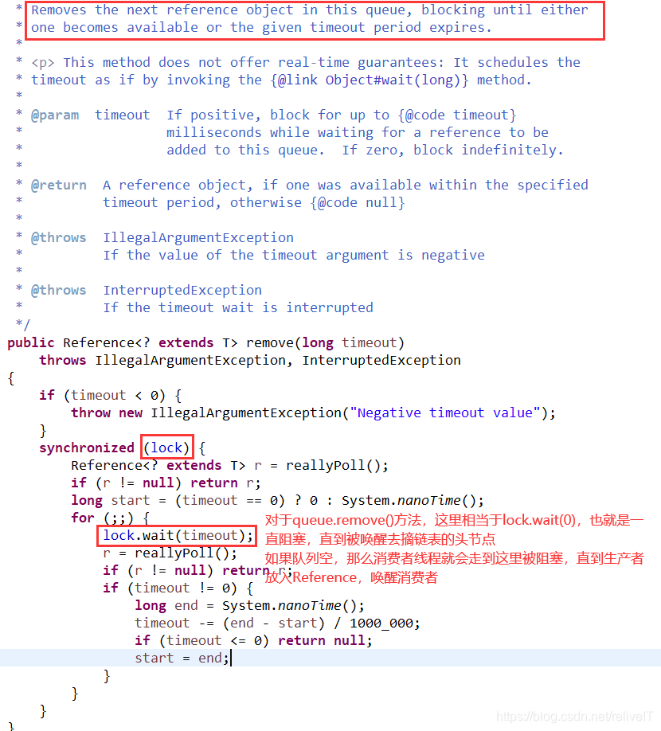

# 关于Java引用Reference
无论是Java堆内存，还是应用的其他资源，给我们提供一种机制能够与JVM GC进行交互联动，使得当GC发生的时候，根据不同的需求能够触发不同的资源回收操作，这个机制就是Java引用期望达到的效果。

根据不同的引用类型，GC会触发不同的资源回收操作
1. Java堆内存：主要是软引用和弱引用，在《SoftReference & WeakReference》中描述；
2. 其他资源：主要是虚引用，在《PhantomReference & jdk.internal.ref.Cleaner》中描述；
3. 兜底机制：FinalReference，在《FinalReference & Finalizer & FinalizerThread》中描述；
4. java.lang.ref.Cleaner：Java 9提供的资源回收机制，在《java.lang.ref.Cleaner》中描述


## （一）Java引用机制的整体流程
### A. 整体流程
1. 当JVM中发生垃圾收集的时候，如果GC发现referent是弱可达的（一定要理解上一章可达性的内容和案例，四种弱可达的对象会被垃圾收集器特殊对待“Treated specially by GC”），那么GC会将封装了该referent的java.lang.ref.Reference及其子类的引用对象挂到pending-reference list上，这条链表是由GC维护的；
2. 当GC将Reference对象挂到**pending-reference list**上时，发生一次线程间通信，会通知ReferenceHandler线程来取走这些节点并进行后续处理；
3. ReferenceHandler线程拿到节点的后续处理如下：
   1. 如果节点Reference是jdk.internal.ref.Cleaner的实例，那么调用其方法jdk.internal.ref.Cleaner.clean()，这个方法会执行事先写好的释放资源的代码；
   2. 否则，如果是其他的引用类型的实例（SoftReference、WeakReference、PhantomReference、FinalReference），那么拿到其实例化时构造函数中传入的**ReferenceQueue**并调用该队列的enqueue函数，将引用对象入队列；
      1. 对于SoftReference和WeakReference，入队列其实没有太大意义，因为这俩对应着应用对Java堆内存的两种不同程度的需求，而Java堆内存的释放会由GC自动管理，所以通常使用软引用和弱引用的时候不会关联ReferenceQueue；
      2. 对于PhantomReference，对应着应用对其他资源的释放需求（例如堆外native memory、文件句柄、socket端口等），几乎没有直接使用PhantomReference的，而都是用其子类jdk.internal.ref.Cleaner，在ReferenceHandler中调用clean方法执行事先写好的释放资源的代码逻辑；
      3. 对于FinalReference，也几乎没有直接使用该类的，而都是直接使用其子类java.lang.ref.Finalizer，在队列中会发生第二次线程间通信，ReferenceHandler线程在将Reference对象入队列时，会通知FinalizerThread做进一步的处理——即调用FinalReference封装的referent重写的java.lang.Object的finalize()方法；
4. java.lang.ref.Cleaner的回收机制，JDK9引入

### B. 核心要点
- 整个流程中有**两个数据结构**：引用对象实例化时通过构造函数传入的ReferenceQueue、JVM维护的pending-reference list
- 整个流程中有**两个VM线程**：ReferenceHandler和FinalizerThread
- 整个流程中包含了**两个生产者-消费者模型**：
  1. 第一个生产者-消费者模型：`GC --> pending-reference list --> ReferenceHandler`
     - 生产者：GC
     - 产品：引用对象（封装的referent失去强引用的java.lang.ref.Reference实例，或者说其封装的referent的可达性从强可达变成其中一种弱可达的引用对象）
     - 仓库：pending-reference list
     - 消费者：ReferenceHandler线程
     
     该模型适用于：Soft Reference、Weak Reference、Phantom Reference、jdk.internal.ref.Cleaner

  2. 第二个生产者-消费者模型：`ReferenceHandler --> ReferenceQueue --> FinalizerThread`
     - 生产者：ReferenceHandler
     - 产品：引用对象（从第一个生产者-消费者模型的pending-reference list上刚摘下来的引用对象）
     - 仓库：ReferenceQueue（每一个引用对象在实例化时通过构造函数传入的ReferenceQueue）
     - 消费者：主要是FinalizerThread
     
     该模型适用于：FinalReference、Finalizer

## （二）Treated specially by GC【各引用特点】

示例代码：

```java
// resObj强可达
ResourceObj resObj = new ResourceObject("分配资源");
// 将resObj封装到某一种Java引用中，作为其referent
// 此时resObj和reference都是强可达的，都在GC roots上
Reference reference = new XxxReference(resObj);
// 断开resObj的强引用，此时只能通过Java引用对象reference访问到resObj
// 这种状态下的resObj是四种弱可达中的某一种
// 尽管reference依旧是强可达的，当GC发现referent是弱可达的时候，那封装referent的Reference就会treated specially by gc
resobj = null;
```

### 1. 软引用
#### 满足条件
1. Java堆内存资源紧张；
2. referent软可达的时间超过“上一次GC剩余的堆内存空间`max_heap * SoftRefLRUPolicyMSPerMB`”，**-XX:SoftRefLRUPolicyMSPerMB**还需要参考虚拟机是以client还是server模式启动；

#### 操作
1. clear referent，即断开Java引用和referent之间的链接，`Reference.referent = null`；
2. 将对应的Java引用挂到pending-reference list上；

### 2. 弱引用
#### 满足条件
- 发生GC并被扫描到

#### 操作
1. 同软引用

### 3. 虚引用 & jdk.internal.ref.Cleaner
#### 满足条件
- 发生GC并被扫描到

#### 操作
1. 同软引用

### 4. FinalReference & Finalizer
#### 满足条件
- 发生GC并被扫描到

#### 操作
1. 和其他三种弱引用不同，FinalReference被GC挂到pending-reference list上的时候不会clear referent，Reference.referent的引用关系一直保留，直到被FinalizerThread调用完才会断开referent的引用；
2. FinalReference/Finalizer的next属性设置为this值（默认值为null），然后将对应的Java引用挂到pending-reference list上；

FinalReference机制是最复杂的：什么样的对象在什么时候会被VM自动封装成一个FinalReference，这和-XX:-RegisterFinalizersAtInit虚拟机参数有关系。

## （三）Reference概览

### java.lang.ref.Reference（JDK 15）
#### 属性
- referent：引用关联的对象，通常是应用中需要关注的资源对象
- next：用于维护ReferenceQueue队列结构，在队列结构中指向下一个节点
- queue：java.lang.ref.ReferenceQueue类型，引用对象创建时通过构造函数传入的关联的队列，队列结构由Java引用的next属性维护
- discovered：用于维护pending-reference list队列结构，在队列结构中指向下一个节点，相当于next属性，不过各自维护不同的队列结构
> - static pending：在JDK8及以前，这个静态属性在Reference的源码中存在，即pending-reference list的链表头，JDK9以后就删掉了，完全交给VM来维护

> 通过属性可以得知有两个队列：
> - ReferenceQueue：即Reference的queue属性，队列结构由next属性来维护；
> - pending-reference list：由虚拟机来维护，早期版本略有不同，队列结构由discovered来维护，这个像属性相当于链表的next，指向链表中下一个节点；

#### 方法
- get/clear
- enqueue/isEnqueued：关注enqueue方法，因为会断开referent的引用

#### 构造函数
- Reference(T)：如果创建的引用对象的时候不关联一个ReferenceQueue，那么会给一个默认的队列ReferenceQueue.NULL
- Reference(T, ReferenceQueue)

#### 静态内部类
ReferenceHandler，整个java.lang.ref包的核心逻辑一大半都在这个这个内部类中

#### 静态代码块
启动ReferenceHandler线程




## （四）referent

### 1. 状态变化
两个维度来刻画引用对象的状态：

引用所处的阶段：active、pending、inactive
关联的引用队列：registered、enqueued、dequeued、unregistered

#### active
刚创建的引用对象就是active的，此时引用对象还有持有referent的指针，并且没有被GC挂到pending-reference list上。

#### pending
如果满足GC条件，引用对象被GC挂到pending-reference list上，此时引用就是pending状态。

pending状态下，引用断开了referent的指针，说明正如上一章包规范中所述，引用被挂到pending-reference list上，会clear referent。

#### inactive
走完了流程的引用对象（对于FinalReference & Finalizer会经历两个生产者消费者模型，对于其他引用会经历第一个生产者消费者模型），就进入inactive状态。

此时虽然referent的资源确定会被回收，但是别忘了Java引用Reference还是强引用，怎么让Reference变为不可达，可以参考java.lang.ThreadLocal在增删时发现key==null时会清理entry（此时key=referent，entry=WeakReference）。

#### registered
实例化引用对象的时候，从其构造方法中传入一个引用队列，此时引用对象就是registered状态。

#### enqueued
当referent的可达性发生变化，引用对象就会进入第一个生产者-消费者模型中，在ReferenceHandler线程中会拿到引用对象的队列并将引用进栈（如果引用创建的时候关联过一个队列），并将Reference的queue属性修改为ReferenceQueue.EQNUEUE，标志该引用已经进队列了。

#### dequeued
创建时关联过队列，然后走完第二个生产者-消费者模型，即出ReferenceQueue队列

注意：如果创建时没有关联过队列，那么默认该应用对象的队列就是ReferenceQueue.NULL，不过他的next=null，而不是this。

#### unregistered
创建时没有关联过队列，默认队列是ReferenceQueue.NULL，此时引用的生命周期中都不会进入一个ReferenceQueue。

### 2. FinalReference的例外
刚才上面介绍引用的pending状态时，讲的是当引用被GC挂到pending-reference list上的时候，会clear referent，即referent的引用会被断开。

但是FinalReference和其他引用是有区别的，因为FinalReference被GC加入pending-reference list的时候，不会clear referent，因为在第二个生产者-消费者模型中，FinalizerThread从ReferenceQueue中拿到引用对象后，会调用Reference.get方法拿到referent，并调用referent重写的finalize方法。

FinalReference/Finalizer被GC加入pending-reference list虽然不会clear referent，但是他的next属性会被设置为this（即FinalReference.next = this），next属性的this值被用来维护FinalReference/Finalizer的non-active active状态。

hotspot中对Java引用进行预处理的入口ReferenceProcessor::discover_reference函数，在这个函数中就会对FinalReference的next属性做检测，判断该FinalReference是否已经被处理过了。

## （五）ReferenceQueue和next

码注释中讲的很直白了，next属性就是用来链接ReferenceQueue的，而且是一条单链表，链表的头节点在ReferenceQueue中定义，Reference作为链表节点。



enqueue方法和remove方法，这两个方法发起的线程间通信是后面Finalizer基于队列的生产者-消费者模型所必须的，且都是同步阻塞方法：






## （六）pending-reference list和discovered
pending-reference list链表结构并没有在Java.lang.ref包的源码中有直观体现，但是在java.lang.ref.Reference的源码中有多处注释提到，并且在ReferenceHandler线程的源码中能窥见其结构。

在源码中解释Java引用类pending状态的注释，pending-reference list是由discovered属性链接而成的一条单链表，链表上的节点等待ReferenceHandler的进一步处理。

discovered属性的注释，pending-reference list由GC来维护，用来保存那些GC时需要被进一步处理的引用对象。

因为pending-reference list上的节点等待ReferenceHandler线程的进一步处理，而pending-reference list是由discovered属性链接成的一条单链表，所以从ReferenceHandler线程的代码逻辑中可以得知：pending-reference list是一条头插法的单链表：


## （七）ReferenceHandler

ReferenceHandler线程的逻辑并不复杂，run方法的逻辑就做两件事情（基于JDK15源码）：

- 第一件事：如果pending-reference list链表没有节点，那就等待，否则把pending-reference list链表上的所有节点摘过来

- 第二件事：循环处理摘过来的节点
如果节点是jdk.internal.ref.Cleaner的实例，那么调用其clean方法，执行事先写好的的资源释放逻辑；
否则，如果满足条件——节点没有进过队列、创建时关联过队列、没有出过队列——那么拿到节点的引用队列（即Reference的queue属性，类型是ReferenceQueue），并调用队列的enqueue方法将引用入队列；
至于在静态代码块中预加载并初始化jdk.internal.ref.Cleaner类，给的理由是“pre-load and initialize Cleaner class so that we don't get into trouble later in the run loop if there's memory shortage while loading/initializing it lazily.”

jdk15源码：
```java
    /* High-priority thread to enqueue pending References
     */
    private static class ReferenceHandler extends Thread {
 
        private static void ensureClassInitialized(Class<?> clazz) {
            try {
                Class.forName(clazz.getName(), true, clazz.getClassLoader());
            } catch (ClassNotFoundException e) {
                throw (Error) new NoClassDefFoundError(e.getMessage()).initCause(e);
            }
        }
 
        static {
            // pre-load and initialize Cleaner class so that we don't
            // get into trouble later in the run loop if there's
            // memory shortage while loading/initializing it lazily.
            ensureClassInitialized(Cleaner.class);
        }
 
        ReferenceHandler(ThreadGroup g, String name) {
            super(g, null, name, 0, false);
        }
 
        public void run() {
            while (true) {
                processPendingReferences();
            }
        }
    }
 
    private static void processPendingReferences() {
        // Only the singleton reference processing thread calls
        // waitForReferencePendingList() and getAndClearReferencePendingList().
        // These are separate operations to avoid a race with other threads
        // that are calling waitForReferenceProcessing().
        waitForReferencePendingList();
        Reference<Object> pendingList;
        // 相对于jdk8，同步代码块的小优化
        synchronized (processPendingLock) {
            pendingList = getAndClearReferencePendingList();
            processPendingActive = true;
        }
        while (pendingList != null) {
            Reference<Object> ref = pendingList;
            pendingList = ref.discovered;
            ref.discovered = null;
 
            if (ref instanceof Cleaner) {
                ((Cleaner)ref).clean();
                // Notify any waiters that progress has been made.
                // This improves latency for nio.Bits waiters, which
                // are the only important ones.
                synchronized (processPendingLock) {
                    processPendingLock.notifyAll();
                }
            } else {
                ReferenceQueue<? super Object> q = ref.queue;
                if (q != ReferenceQueue.NULL) q.enqueue(ref);
            }
        }
        // Notify any waiters of completion of current round.
        synchronized (processPendingLock) {
            processPendingActive = false;
            processPendingLock.notifyAll();
        }
    }

```

对比JDK 8源码，最主要的差异有两处，一处是static pending属性，另一个ReferenceHanlder线程的run方法，见源码注释：
```java
public abstract class Reference<T> {
    private T referent;         /* Treated specially by GC */
 
    // next是ReferenceQueue中单链表的指针，用于指向链表的下一个节点
    volatile ReferenceQueue<? super T> queue;
    Reference next;
 
    // pending属性是pending-reference list的链表头
    // discovered属性是pending-reference list中单链表的指针，用于指向链表的下一个节点
    transient private Reference<T> discovered;  /* used by VM */
    private static Reference<Object> pending = null;
 
    private static class ReferenceHandler extends Thread {
        private static void ensureClassInitialized(Class<?> clazz) {
            try {
                Class.forName(clazz.getName(), true, clazz.getClassLoader());
            } catch (ClassNotFoundException e) {
                throw (Error) new NoClassDefFoundError(e.getMessage()).initCause(e);
            }
        }
 
        static {
            // pre-load and initialize InterruptedException and Cleaner classes
            // so that we don't get into trouble later in the run loop if there's
            // memory shortage while loading/initializing them lazily.
            ensureClassInitialized(InterruptedException.class);
            ensureClassInitialized(Cleaner.class);
        }
 
        ReferenceHandler(ThreadGroup g, String name) {
            super(g, name);
        }
 
        public void run() {
            while (true) {
                tryHandlePending(true);
            }
        }
    }
 
    // 方法的逻辑没有变化，都是从pending-reference list上摘下节点做进一步的处理
    // 但是有同步优化，并不需要每次都在同步代码块中慢慢操作一个个链表节点
    // 而是只需要把pending-reference list整条摘下来，放到ReferenceHandler中做单线程处理
    // JDK9之后的同步代码块只有两句代码：就是把pending-reference list整条摘过来
    static boolean tryHandlePending(boolean waitForNotify) {
        Reference<Object> r;
        Cleaner c;
        try {
            synchronized (lock) {
                if (pending != null) {
                    r = pending;
                    c = r instanceof Cleaner ? (Cleaner) r : null;
                    pending = r.discovered;
                    r.discovered = null;
                } else {
                    // The waiting on the lock may cause an OutOfMemoryError
                    // because it may try to allocate exception objects.
                    if (waitForNotify) {
                        lock.wait();
                    }
                    // retry if waited
                    return waitForNotify;
                }
            }
        } catch (OutOfMemoryError x) {
            Thread.yield();
            return true;
        } catch (InterruptedException x) {
            return true;
        }
 
        if (c != null) {
            c.clean();
            return true;
        }
 
        ReferenceQueue<? super Object> q = r.queue;
        if (q != ReferenceQueue.NULL) q.enqueue(r);
        return true;
    }
}

```


